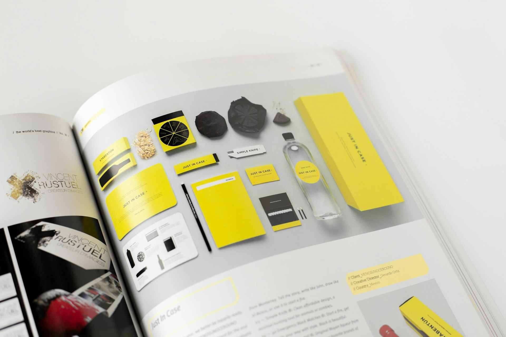

import imageLeslieAlexander from '@/images/team/UI_designer.jpg'

export const article = {
  date: '2023-02-18',
  title: 'The Benefits of Having a Professional Logo When Starting a Small Business',
  description:
    'A professional logo is more than just a pretty picture; it’s a crucial element of your brand identity that can significantly impact your business’s success. Here’s why investing in a professional logo is a smart move for small businesses.',
  author: {
    name: 'Leslie Alexander',
    role: 'Co-Founder / CEO',
    image: { src: imageLeslieAlexander },
  },
}

export const metadata = {
  title: article.title,
  description: article.description,
}

## 1. Establishes Brand Identity

A professional logo serves as the foundation of your brand identity. It visually communicates your business’s values, mission, and services at a glance. A well-designed logo can make your brand instantly recognizable and memorable, helping to establish a strong presence in your industry.

<TopTip>
  Ensure your logo design aligns with your brand’s core values and resonates with your target audience. This alignment can enhance brand loyalty and trust.
</TopTip>

## 2. Builds Credibility and Trust

In the competitive world of small businesses, credibility and trust are crucial. A professional logo lends legitimacy to your business, signaling to potential customers that you are serious and reliable. It can make your business appear larger and more established, which can be particularly beneficial when competing with bigger companies.

## 3. Enhances Marketing Efforts

Your logo is a key element in all your marketing materials, from your website to your business cards and social media profiles. A cohesive and professional logo ensures consistency across various platforms, making your marketing efforts more effective. It helps create a unified visual identity that reinforces your brand message.

## 4. Creates a Lasting First Impression

First impressions matter, especially in business. Your logo is often the first thing potential customers see, and a well-designed logo can make a positive and lasting impression. It can pique interest and curiosity, encouraging people to learn more about your business.

## 5. Differentiates Your Business

In a crowded market, a unique and professional logo can set your business apart from competitors. It highlights what makes your business special and unique, helping you stand out and attract your ideal customers. A distinctive logo can be a powerful tool in your branding arsenal.

